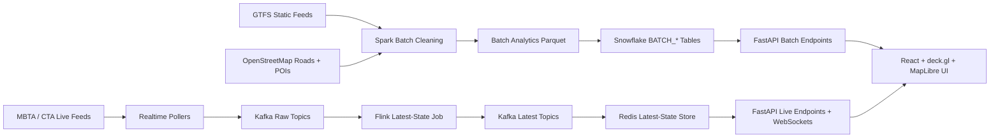

# Presentation Master Guide

## Purpose

This guide is the source-of-truth presentation prep document for the project. It is written for teammates who need to:

- understand the system end to end
- explain it clearly to a semi-technical audience
- defend the architecture and data choices during Q&A

It is grounded in the actual codebase, not just the README.

## What The Presentation Needs To Do

Based on the presentation prompt, the presentation should behave like a pitch to an investor, CDO, or CIO:

- explain the problem clearly to a smart but non-domain-expert audience
- show the complete data pipeline
- justify important design decisions
- present meaningful insights and visualizations
- make it obvious that every teammate contributed and understands a part of the system

The grading dimensions are:

1. Clarity
2. Scoping
3. Mastery of the material

That means the best presentation is not the one with the most technical jargon. It is the one that:

- motivates the project well
- shows the architecture clearly
- highlights why the data engineering choices matter
- demonstrates credible results
- answers questions confidently

## The One-Sentence Project Story

We built a multi-city transit data platform that combines a daily batch analytics pipeline and a live streaming system, then serves both through one dashboard so users can explore transit service intensity, route structure, and neighborhood access in Boston and Chicago.

## Core Architecture Sentence

This is the sentence worth memorizing and repeating naturally during the presentation:

We designed the system so batch handles historical analytics in Snowflake, while streaming handles real-time vehicle state through Kafka, Flink, and Redis, and both are unified through a single API and dashboard.

## What The Project Actually Includes

There are two major product surfaces and one shared platform layer:

1. Batch analytics
   - Chicago and Boston GTFS + OSM
   - Spark cleaning and analytics
   - Snowflake warehouse tables
   - batch dashboard mode in the new React UI

2. Live operations
   - Boston and Chicago live vehicle tracking
   - Kafka + Flink + Redis + FastAPI
   - live dashboard mode in the same React UI

3. Shared serving/UI layer
   - FastAPI in `dashboard/live_api.py`
   - React + deck.gl + MapLibre in `dashboard/web/`

## Suggested 15-Minute Presentation Structure

This is a good default structure for a 3-person team.

### Speaker 1: Problem + Product + Data Sources

Assigned speaker:

- Fortuna

Time: about 3.5 minutes

Cover:

- What problem are we solving?
- Why transit data is interesting
- Why combine batch and live views
- What cities we support
- What data sources we use

Talking points:

- Daily GTFS data tells us the planned network.
- OSM tells us the built environment around the network.
- Live feeds tell us what is happening right now.
- Combining them gives both strategic and operational insight.

Suggested speaking notes:

- Start broad and non-technical.
- Focus on why the problem matters before naming tools.
- Use simple phrases like “planned transit,” “live operations,” and “neighborhood access.”
- End by setting up the pipeline explanation: “Once we had those data sources, we built two coordinated pipelines: a daily batch pipeline and a realtime streaming pipeline.”

### Speaker 2: Batch Data Engineering Pipeline + Storage Model

Assigned speaker:

- Shangwe

Time: about 4.5 minutes

Cover:

- GTFS + OSM ingestion
- raw -> clean -> analytics data layout
- Spark transformations
- Snowflake schema and load
- daily Airflow orchestration
- key batch insights

Suggested speaking notes:

- Emphasize the storage model: raw, clean, analytics.
- Explain that this layering is intentional, not arbitrary.
- Tie Spark directly to scale: millions of `stop_times` rows and repeated joins.
- When discussing Snowflake, say clearly that Snowflake is the batch source of truth.
- End with a handoff into live mode: “That handles historical and scheduled truth. The live side of the system handles what is happening right now.”

### Speaker 3: Live Streaming Pipeline

Assigned speaker:

- Scott

Time: about 4 minutes

Cover:

- realtime feed ingestion
- Kafka + Flink + Redis architecture
- FastAPI + WebSocket serving
- React/deck.gl/MapLibre UI

Suggested speaking notes:

- Present the live path as one clean flow: feed -> poller -> Kafka -> Flink -> Redis -> FastAPI -> React.
- Explain tool roles, not implementation details first.
- Be very clear that Redis is the serving layer and Kafka/Flink are the streaming processing path.
- Mention the fallback path briefly as a reliability decision, not as the main story.
- Hand off to the demo with: “Now that we’ve shown how batch and live are built, Shangwe will show how both appear in the unified dashboard.”

### Demo

Assigned speaker:

- Shangwe

Time: about 2 minutes

Suggested speaking notes:

- Keep the demo short and intentional.
- Show one batch view, one route spotlight or city comparison, then one live view.
- Narrate what the audience is seeing in terms of the architecture they just heard.
- Avoid clicking too much or exploring randomly.
- If live looks sparse, say that feed density varies by time of day and pivot quickly to the strongest visible view.

### Final 3 Minutes

Use for:

- a concise “what is technically impressive here” framing
- quick source-of-truth and reliability reminders
- audience questions

### Questions Slide

Recommended behavior:

- keep all 3 teammates visibly engaged
- let each person answer the questions in their own area first
- if a question gets too detailed or drifts, Shangwe should step in and unify the answer

## Recommended Slide Sequence

1. Problem and motivation
2. System overview
3. Data sources
4. Batch pipeline + data model / storage layers
5. Batch insights
6. Live pipeline + one end-to-end flow story
7. Why these tools / what’s technically impressive
8. Live demo through the site
9. Questions

## Team Presentation Mapping

Recommended ownership:

1. Fortuna
   - Slides 1 to 3
   - problem, motivation, product framing, data sources
2. Shangwe
   - Slides 4 to 5
   - batch pipeline, storage model, warehouse, orchestration
3. Scott
   - Slides 6 to 7
   - live streaming architecture, tool choices, source-of-truth explanation
4. Shangwe
   - Slide 8 demo
   - Slide 9 moderation into Q&A

## System Overview

The codebase has three practical architecture layers:

1. Shared multi-city batch pipeline
2. Shared multi-city live streaming pipeline
3. Shared API + frontend dashboard

### High-Level Architecture



## Data Sources

### Batch Sources

#### GTFS

Configured in `src/common/config.py`.

- Chicago GTFS static URL:
  - `https://www.transitchicago.com/downloads/sch_data/google_transit.zip`
- Boston GTFS static URL:
  - `https://cdn.mbta.com/MBTA_GTFS.zip`

GTFS provides:

- stops
- routes
- trips
- stop_times
- shapes
- and other schedule metadata

Why GTFS matters:

- it is the standard planned-service transit data format
- it lets us compute network structure and scheduled service intensity

#### OSM

Configured in `src/common/config.py` and `src/common/constants.py`.

- Chicago place name:
  - `Chicago, Illinois, USA`
- Boston place name:
  - `Boston, Massachusetts, USA`

OSM provides:

- roads
- POIs / amenities

Why OSM matters:

- GTFS alone tells us where transit exists
- OSM helps explain what riders can access around those stops

### Live Sources

#### Boston live

Source client:

- `src/live/mbta.py`

Feed:

- MBTA V3 realtime vehicle API

#### Chicago live

Source client:

- `src/live/cta.py`

Feeds:

- CTA Bus Tracker
- CTA Train Tracker

Current caveat:

- buses work
- trains are code-complete but currently blocked by an invalid train API key

## One End-To-End Flow Story

This should be said verbally because it makes the whole architecture click much faster.

### Live Path

A single live vehicle update flows from the agency realtime feed to a city-specific poller, into Kafka raw topics, through a Flink latest-state job, into Kafka latest topics, then into Redis, and finally through FastAPI and WebSockets into the React map.

### Batch Path

A single historical schedule dataset flows from GTFS and OSM source files into Spark cleaning, then into analytics parquet outputs, then into Snowflake `BATCH_*` tables, and finally into the dashboard through FastAPI batch endpoints.

### Short Version To Memorize

A single bus update flows from the agency feed to Kafka to Flink to Redis to FastAPI to the React map, while historical data flows from GTFS and OSM through Spark and Snowflake into dashboard queries.

## Batch Pipeline In Depth

### Batch Goal

Produce daily, city-scoped transit analytics for Boston and Chicago, including both:

- classic GTFS schedule metrics
- GTFS + OSM accessibility/context metrics

### Orchestrator

Primary orchestrator:

- `jobs/pipeline/run_city_batch_pipeline.py`

What it does:

1. downloads GTFS
2. downloads OSM
3. cleans GTFS
4. cleans OSM
5. builds analytics
6. optionally loads to Snowflake

Manual wrapper:

- `scripts/run_batch_pipeline.sh`

Airflow DAG:

- `dags/multi_city_batch_pipeline.py`

Current Airflow order:

1. Chicago city batch pipeline
2. Boston city batch pipeline
3. shared Snowflake load

### Data Model And Storage Layers

The batch path intentionally uses three major local storage layers.

#### 1. Raw

Purpose:

- raw extracted downloads
- source-of-truth landing on local disk before cleaning

Paths:

- `data/raw/gtfs/{city}/`
- `data/raw/osm/{city}/`

Examples:

- `data/raw/gtfs/chicago/stops.txt`
- `data/raw/osm/boston/roads.csv`

#### 2. Clean

Purpose:

- standardized, typed, deduplicated parquet outputs
- easier for Spark analytics and Snowflake loading

Paths:

- `data/processed/{city}/clean/gtfs/{dataset}/`
- `data/processed/{city}/clean/osm/{dataset}/`

Examples:

- `data/processed/chicago/clean/gtfs/stops/`
- `data/processed/boston/clean/osm/pois/`

#### 3. Analytics

Purpose:

- finished analytical outputs
- one parquet folder per dataset

Paths:

- `data/processed/{city}/analytics/{dataset}/`

Examples:

- `data/processed/chicago/analytics/route_activity/`
- `data/processed/boston/analytics/stop_poi_access/`

### Why This Layering Matters

This is one of the most important data-modeling points to make in the presentation.

- raw preserves original source files
- clean creates typed normalized joinable tables
- analytics stores precomputed metrics for fast downstream use

The short explanation to say out loud:

We separate raw, clean, and analytics layers so we preserve source data, standardize schemas for reliable joins, and serve precomputed metrics efficiently.

### Batch Idempotency And Resume Behavior

Implemented in:

- `src/common/run_metadata.py`
- `src/common/paths.py`

Run metadata paths:

- `data/staging/run_metadata/{run_id}/{city}/`
- `data/staging/checkpoints/{city}/`

What gets recorded:

- stage status
- command
- row counts
- input/output path stats
- timing
- error messages

Why it matters:

- practical idempotency
- easier reruns
- stage-level resume behavior

This is not full transactional rollback, but it is a strong local-development batch hardening layer.

### Batch Ingestion Jobs

#### GTFS download

File:

- `jobs/ingestion/download_gtfs.py`

What it does:

- reads city config from `src/common/config.py`
- downloads GTFS zip
- saves `gtfs.zip`
- extracts all GTFS `.txt` files into the city raw folder

#### OSM download

File:

- `jobs/ingestion/download_osm.py`

What it does:

- uses `osmnx`
- downloads road network as a drive graph
- converts roads into a flat CSV
- downloads POIs matching relevant tags
- computes centroids for POI geometry

Outputs:

- `roads.csv`
- `pois.csv`

### Batch Cleaning Jobs

#### GTFS cleaning

File:

- `jobs/spark/clean_gtfs_city.py`

Reads:

- `stops.txt`
- `routes.txt`
- `trips.txt`
- `stop_times.txt`
- `shapes.txt`

Writes:

- clean `stops`
- clean `routes`
- clean `trips`
- clean `stop_times`
- clean `shapes`

Important design detail:

- Boston and Chicago GTFS schemas are not perfectly identical
- the cleaner handles optional columns like `direction` and `schd_trip_id`

Transform behavior:

- trims strings
- casts numeric types
- drops invalid rows
- deduplicates key entities
- writes parquet with `mode("overwrite")`

#### OSM cleaning

File:

- `jobs/spark/clean_osm_city.py`

Reads:

- `roads.csv`
- `pois.csv`

Road cleaning:

- selects coordinates and metadata
- filters to relevant highway classes
- deduplicates by `city + osm_id`

POI cleaning:

- filters to relevant categories
- maps `poi_category` to higher-level `poi_group`
- deduplicates by `city + osm_id`

### Batch Analytics Jobs

Primary file:

- `jobs/spark/build_city_batch_analytics.py`

This is the most important batch analytics job.

It builds nine datasets:

1. `stop_activity`
2. `stop_activity_enriched`
3. `route_activity`
4. `stop_activity_by_route`
5. `route_shapes`
6. `stop_poi_access`
7. `busiest_stops_with_poi_context`
8. `route_poi_access`
9. `transit_road_coverage`

#### 1. Stop activity

Question:

- Which stops have the most scheduled stop events?

Method:

- group `stop_times` by `city, stop_id`
- count rows as `trip_count`

#### 2. Stop activity enriched

Question:

- What are the busiest stops, with names and coordinates?

Method:

- join `stop_activity` with `stops`

#### 3. Route activity

Question:

- Which routes are busiest overall?

Method:

- join `stop_times`, `trips`, and `routes`
- compute:
  - `stop_event_count`
  - `distinct_trip_count`
  - `distinct_stop_count`

#### 4. Stop activity by route

Question:

- Which stops are busiest on each route?

Method:

- join stop_times, trips, routes, and stops
- group by route + stop

#### 5. Route shapes

Question:

- What is the geometry of each route?

Method:

- join routes/trips to shapes
- retain ordered shape points

#### 6. Stop POI access

Question:

- What amenities are near each transit stop?

Method:

- cross-join stops and POIs
- apply lat/lon bounding box
- compute haversine distance
- keep pairs within `STOP_POI_ACCESS_DISTANCE_M`

Metrics:

- total POIs within 400m
- food POIs within 400m
- critical service POIs within 400m
- park POIs within 400m
- nearest school/hospital/grocery/park
- set of nearby POI categories

#### 7. Busiest stops with POI context

Question:

- Which high-service stops are also embedded in rich surrounding neighborhoods?

Method:

- left join `stop_activity_enriched` to `stop_poi_access`

#### 8. Route POI access

Question:

- Which routes serve the richest amenity access overall?

Method:

- join `stop_activity_by_route` with `stop_poi_access`
- aggregate per route

Metrics:

- total POI access
- average POI access per stop
- max POI access at any stop
- number of route stops near hospitals, groceries, and parks

#### 9. Transit road coverage

Question:

- How much of each road class lies within reach of transit?

Method:

- cross-join road midpoints with stops
- apply bounding box
- compute haversine distance
- keep rows within `TRANSIT_ROAD_COVERAGE_DISTANCE_M`
- aggregate by road type

Metrics:

- total road segments
- road segments near transit
- coverage percentage
- total and covered road length

### Why These Analytics Matter

- stop activity explains where service is concentrated
- route activity explains which lines dominate the network
- stop POI access explains which stops connect riders to useful destinations
- route POI access explains which routes provide the richest corridor access
- transit road coverage ties transit availability back to the surrounding street network

## Snowflake Warehouse Layer

### Why Snowflake

Snowflake is the batch warehouse and presentation-grade source of truth for batch outputs.

It supports:

- persistent analytical storage
- SQL verification queries
- serving batch insights through FastAPI

Presentation wording:

- Snowflake gives us scalable OLAP-style queries over large historical batch datasets.

### Connection

File:

- `src/snowflake/connector.py`

Auth method:

- private key authentication

Environment variables used:

- `SNOWFLAKE_USER`
- `SNOWFLAKE_ACCOUNT`
- `SNOWFLAKE_WAREHOUSE`
- `SNOWFLAKE_DATABASE`
- `SNOWFLAKE_SCHEMA`
- `SNOWFLAKE_ROLE`
- `SNOWFLAKE_PRIVATE_KEY_FILE`

### DDL Files

Location:

- `sql/ddl/raw_tables.sql`
- `sql/ddl/clean_tables.sql`
- `sql/ddl/analytics_tables.sql`

These all target:

- role: `TRAINING_ROLE`
- warehouse: `MARMOT_WH`
- database: `MARMOT_DB`
- schema: `CHICAGO_TRANSIT`

### Raw Tables

Purpose:

- landing-layer schemas
- source-style structure for GTFS and OSM tables

Examples:

- `RAW_GTFS_STOPS`
- `RAW_GTFS_TRIPS`
- `RAW_OSM_ROADS`
- `RAW_OSM_POIS`

### Clean Tables

Purpose:

- cleaned static tables
- one older Chicago-oriented set plus new multi-city batch tables

Examples:

- `CLEAN_GTFS_STOPS`
- `CLEAN_GTFS_ROUTES`
- `BATCH_GTFS_STOPS`
- `BATCH_OSM_POIS`

### Analytics Tables

Purpose:

- classic analytics tables and multi-city batch analytics tables

Examples:

- `ANALYTICS_ROUTE_ACTIVITY`
- `BATCH_STOP_POI_ACCESS`
- `BATCH_ROUTE_POI_ACCESS`
- `BATCH_TRANSIT_ROAD_COVERAGE`

### Snowflake Load Job

File:

- `jobs/load/load_to_snowflake.py`

What it does:

1. opens a Snowflake connection
2. executes all DDL files
3. loads older clean/analytics parquet folders
4. loads new multi-city `BATCH_*` parquet folders

How data gets loaded:

- reads parquet with pandas
- uppercases column names
- uses `snowflake.connector.pandas_tools.write_pandas`

Important design detail:

- batch partitioned tables are loaded by concatenating all city parquet partitions first

Important limitation:

- `write_pandas` creates local temp parquet chunks
- this can fail if the laptop is low on disk space

### Batch Source Of Truth

Be explicit during the presentation:

- batch source of truth = Snowflake
- local parquet = pipeline output and intermediate storage
- the browser does not query Snowflake directly

## Batch Serving Layer

### Why The Browser Does Not Query Snowflake Directly

We intentionally keep the browser away from direct Snowflake access.

Instead:

- `src/batch/service.py` handles Snowflake queries
- `dashboard/live_api.py` exposes batch endpoints
- React consumes FastAPI JSON

Benefits:

- cleaner security model
- stable response contracts
- easier caching
- simpler frontend

### Batch Service

File:

- `src/batch/service.py`

Responsibilities:

- list supported batch cities
- query city dashboard summaries
- query route catalogs
- query per-route detail
- compute cross-city comparison
- cache results in memory

### Batch API Endpoints

Defined in:

- `dashboard/live_api.py`

Endpoints:

- `GET /api/batch/cities`
- `GET /api/batch/comparison`
- `GET /api/batch/bootstrap`
- `GET /api/batch/{city}/dashboard`
- `GET /api/batch/{city}/routes`
- `GET /api/batch/{city}/routes/{route_id}`

What the frontend uses them for:

- city list
- comparison cards
- batch snapshot / KPIs
- route catalog
- route spotlight detail

## Live Pipeline In Depth

### Live Goal

Show the current latest known location of vehicles in Boston and Chicago on an interactive map, while still demonstrating a real streaming data engineering architecture.

### Why This Live Design Works

- pollers normalize city-specific feeds into one shared contract
- Kafka decouples ingestion from downstream processing
- Flink provides stateful latest-event logic
- Redis gives fast low-latency reads
- FastAPI keeps the frontend contract stable

### Shared Live Contract

File:

- `src/live/models.py`

Core model:

- `LiveVehicleState`

Fields include:

- `city`
- `vehicle_id`
- `route_id`
- `route_label`
- `trip_id`
- `stop_id`
- `label`
- `latitude`
- `longitude`
- `bearing`
- `speed`
- `current_status`
- `occupancy_status`
- `direction_id`
- `route_type`
- `updated_at`
- `feed_timestamp`
- `source`

Why this matters:

- every upstream client normalizes into the same schema
- Kafka, Flink, Redis, FastAPI, and React all depend on this contract

### Live Config

File:

- `src/live/config.py`

Important config:

- supported cities
- map centroids and zoom defaults
- Redis URL
- API host/port
- polling intervals
- MBTA/CTA credentials

Current poll settings:

- global default: `5s`
- Boston default: `3s`
- Chicago default: `4s`

### Live Feed Clients

#### MBTA

File:

- `src/live/mbta.py`

What it does:

- calls MBTA realtime API
- normalizes vehicle records into `LiveVehicleState`

#### CTA

File:

- `src/live/cta.py`

Important design detail:

- CTA Bus Tracker does not support one global all-vehicle query
- so the client:
  - discovers active routes
  - batches active route polling
  - deduplicates results

Train support:

- implemented
- currently blocked by invalid CTA train credentials

### Realtime Pollers

#### Kafka path

Files:

- `jobs/realtime/mbta_poll_to_kafka.py`
- `jobs/realtime/cta_poll_to_kafka.py`

What they do:

- poll upstream feed
- normalize vehicle data
- publish JSON payloads to Kafka raw topics

#### Direct fallback path

Files:

- `jobs/realtime/mbta_poll_to_redis.py`
- `jobs/realtime/cta_poll_to_redis.py`

What they do:

- bypass Kafka and Flink
- write directly to Redis

Why fallback exists:

- lowers demo risk
- if streaming infrastructure has problems, the live UI can still work

### Kafka Topic Design

Defined in:

- `src/live/topics.py`

Naming convention:

- raw: `transit.live.raw.{city}.vehicles`
- latest: `transit.live.latest.{city}.vehicles`

Why city-scoped topics:

- multi-city support
- no frontend contract changes
- easy partitioning of runtime responsibilities

### Flink Job

File:

- `jobs/realtime/flink_vehicle_latest_job.py`

What it does:

- consumes raw Kafka events
- keys by `city + vehicle_id`
- stores latest timestamp in keyed state
- emits only the newest event per vehicle

Why Flink exists:

- this is the real streaming stateful processing layer
- it demonstrates more than simple polling + caching

Presentation wording:

- Flink lets us do stateful stream processing instead of just forwarding raw events.

### Redis Latest-State Store

File:

- `src/live/redis_store.py`

Why Redis is used:

- latest-state serving store
- very fast reads
- pub/sub support for WebSocket broadcasting

Per city it stores:

- one key per vehicle
- one vehicle ID index
- one metadata hash
- one update channel

Example key patterns:

- `transit:live:boston:vehicle:{vehicle_id}`
- `transit:live:boston:vehicles:index`
- `transit:live:boston:metadata`
- `transit:live:boston:updates`

### Kafka To Redis Bridge

File:

- `jobs/realtime/kafka_latest_to_redis.py`

What it does:

- consumes latest-state Kafka topic
- validates records as `LiveVehicleState`
- upserts into Redis

This is the bridge from the streaming layer to the serving layer.

### Live Source Of Truth

Say it this way:

- preferred live event path = Kafka -> Flink latest-state path
- live serving layer = Redis
- live UI reads through FastAPI and WebSockets backed by Redis

This wording is accurate and still acknowledges the fallback path.

## API Layer

File:

- `dashboard/live_api.py`

Why one API for both modes:

- simpler product story
- one frontend
- one backend surface
- different storage backends hidden behind the API

### Live Endpoints

- `GET /api/live/cities`
- `GET /api/live/{city}/vehicles`
- `GET /api/live/{city}/health`
- `WS /ws/live/{city}`

### Batch Endpoints

- `GET /api/batch/cities`
- `GET /api/batch/comparison`
- `GET /api/batch/bootstrap`
- `GET /api/batch/{city}/dashboard`
- `GET /api/batch/{city}/routes`
- `GET /api/batch/{city}/routes/{route_id}`

## Frontend Stack

### Tech Stack

Defined in `dashboard/web/package.json`.

Core frontend dependencies:

- React
- Vite
- deck.gl
- react-map-gl
- maplibre-gl

### Why These Choices

#### React

- component-based stateful UI
- natural fit for multi-mode dashboard

#### deck.gl

- efficient geospatial layers
- good fit for large sets of stop and vehicle markers
- path and scatterplot layers work well for routes and live positions

#### MapLibre

- real basemap
- open and flexible
- better map storytelling than a blank canvas

## What Is Technically Impressive

Make this explicit, because it is easy to undersell.

The most impressive engineering choices are:

1. Combining batch and streaming in one product instead of separate demos.
2. Building a city-aware architecture for Boston and Chicago.
3. Using Flink for latest-state stream processing instead of just direct polling.
4. Joining GTFS transit structure with OSM neighborhood context.
5. Serving batch through an API layer instead of querying the warehouse directly from the browser.

Short explanation to say out loud:

This project is not just a dashboard. It is a full data platform with batch processing, streaming state management, warehouse serving, and a shared UI.

## Transition Lines Between Speakers

These are optional, but they will make the presentation feel much more polished.

### Fortuna -> Shangwe

“Those were the main data sources and the product goal. Shangwe will now walk through how we turned those raw transit and map datasets into a structured daily batch pipeline.”

### Shangwe -> Scott

“That covers the historical side of the system. Scott will now explain the live streaming side, which handles realtime vehicle movement and latest-state serving.”

### Scott -> Shangwe

“Now that we’ve shown how the live and batch systems are built, Shangwe will show how both appear in the shared dashboard.”

## Practical Design Defenses

These are the most important architecture justifications to know for Q&A.

### Why use both batch and live modes?

Because they answer different questions.

- batch answers:
  - what does the planned network look like?
  - where is service concentrated?
  - what neighborhoods and amenities does transit connect?

- live answers:
  - what is happening right now?
  - where are vehicles currently moving?
  - how can we visualize current operations?

### Why use OSM?

GTFS alone describes transit supply. OSM adds urban context:

- nearby destinations
- essential services
- roads around transit

That makes the project more analytically interesting than “just count trips.”

### Why use Spark?

Because GTFS `stop_times` and shape data are large enough that distributed-style transformations and parquet outputs are a good fit, and Spark lets us process millions of schedule records and joins efficiently.

### Why use Kafka and Flink if direct polling to Redis exists?

Because the project is a data engineering project, not just a dashboard project.

- Kafka gives us a durable streaming buffer
- Flink gives us stateful stream processing
- Redis is only the latest-state serving layer

The direct path exists only as a demo-safe fallback.

### Why use Redis?

Because the live UI needs fast, latest-state reads and pub/sub updates, not warehouse queries.

### Why use Snowflake for batch but Redis for live?

Because the access pattern is different.

- Snowflake is good for analytical batch data
- Redis is good for fast operational latest-state reads

### Why not query Snowflake directly from the browser?

Because FastAPI gives us:

- stable response contracts
- centralized caching
- cleaner security boundaries
- dashboard-shaped responses instead of exposing warehouse structure directly

## Known Limitations You Should Be Honest About

1. Chicago train live mode is currently blocked by credentials.
2. Overnight live vehicle volume can be sparse, especially in Boston.
3. The batch pipeline is stage-resumable and practically idempotent, but not a fully transactional enterprise workflow.
4. The batch warehouse load can be constrained by local disk because `write_pandas` creates temporary parquet chunks.
5. The live UI currently prioritizes latest-state visualization, not full historical replay.

## Reliability And Robustness Points

These are worth mentioning briefly.

- Airflow enables scheduled reruns for the batch path.
- Stage manifests and checkpoints make the city-aware batch pipeline resumable.
- Kafka decouples realtime ingestion from downstream processing.
- Redis gives the live dashboard fast reads even under UI load.
- FastAPI keeps both live and batch behind stable backend contracts.

## Likely Q&A And Strong Answers

### Q: Why did you choose Boston and Chicago?

A:

- Boston gives us the strongest live demo through the MBTA feed.
- Chicago was the original batch/static city and already had a GTFS foundation.
- Together they let us show a multi-city platform rather than a single hardcoded demo.

### Q: Why not query Snowflake directly from the browser?

A:

- We wanted stable backend contracts, centralized caching, and cleaner security boundaries.
- FastAPI lets us shape dashboard-friendly responses rather than expose warehouse structure directly.

### Q: What is the difference between raw, clean, and analytics?

A:

- raw stores ingested source files
- clean stores typed and standardized parquet tables
- analytics stores finished metrics used by Snowflake and the dashboard

### Q: How do you handle schema differences between agencies?

A:

- We standardized around a common cleaned schema.
- Optional GTFS columns are handled explicitly, for example in `clean_gtfs_city.py`.
- That lets Boston and Chicago share the same downstream analytics contracts.

### Q: Why use a cross join for stop-to-POI access?

A:

- We first reduce the candidate space with latitude/longitude thresholds.
- Then we compute haversine distance only for plausible pairs.
- For the current project scale, that was a simple and workable spatial approximation.

### Q: Why is Redis not your source of truth?

A:

- Redis is a serving store for latest state only.
- Snowflake is the batch source of truth.
- Upstream feeds and Kafka topics are the live event path.

### Q: How is the pipeline idempotent?

A:

- batch stages write manifests and checkpoints
- outputs use overwrite semantics
- rerunning the same `run_id` skips already completed stages if outputs still exist

### Q: What would you improve next?

A:

- stronger validation and QA checks
- more polished batch UI
- better route- and city-level storytelling
- fuller CTA train live integration once credentials are fixed

## Demo Checklist

Before presenting:

1. Confirm batch data is loaded into Snowflake.
2. Confirm FastAPI and the React UI are running.
3. Confirm Boston live health endpoint is healthy.
4. Confirm Chicago live health endpoint is healthy.
5. Have screenshots ready in case the live feed is sparse.
6. Have one clear batch story and one clear live story.
7. Keep the live demo short enough that Q&A time is protected.

Useful commands:

```bash
bash scripts/live.sh all
bash scripts/live.sh status
bash scripts/run_batch_pipeline.sh all --load-snowflake
```

Useful URLs:

- `http://127.0.0.1:5173`
- `http://127.0.0.1:8000/api/live/boston/health`
- `http://127.0.0.1:8000/api/live/chicago/health`

## The Most Important Things Every Teammate Should Memorize

1. The project has both batch and live pipelines.
2. Batch uses GTFS + OSM + Spark + Snowflake.
3. Live uses MBTA/CTA + Kafka + Flink + Redis + FastAPI.
4. Both modes are served through one shared React dashboard.
5. Snowflake is the batch source of truth.
6. The preferred live event path is Kafka -> Flink, and Redis is the live serving layer.
7. Airflow runs the daily multi-city batch pipeline.
8. The main analytical contribution is combining transit schedule structure with neighborhood context from OSM.
